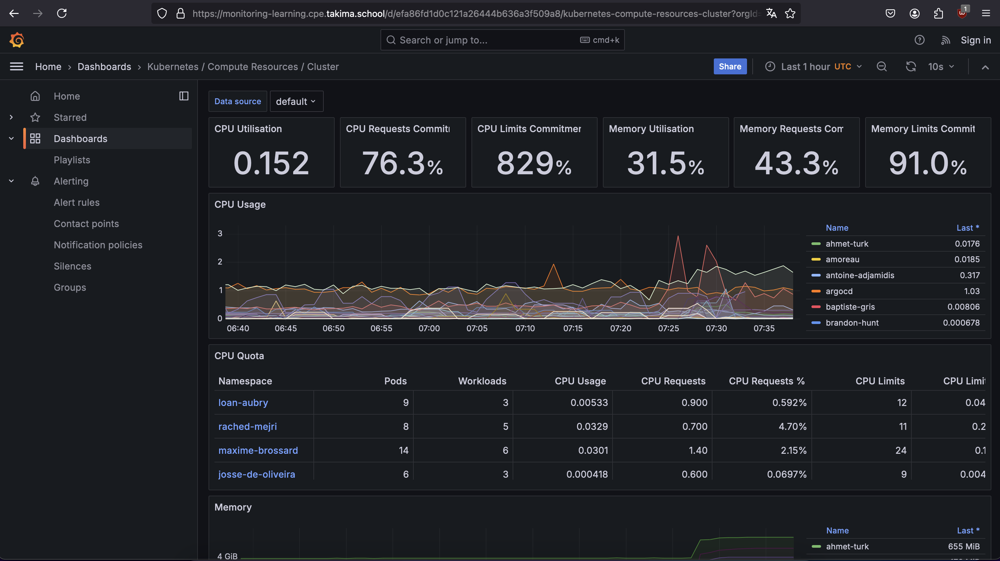
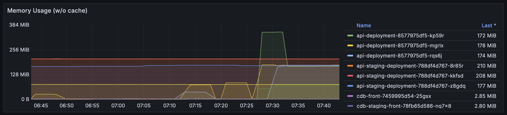
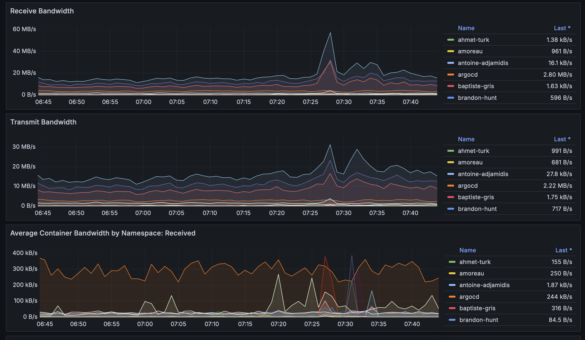
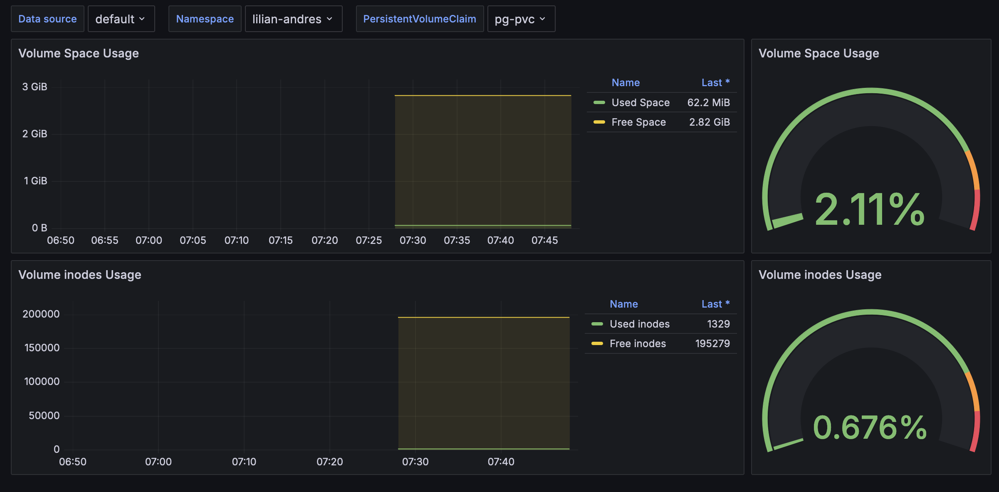

# Jour 4 - Monitoring

### Avec cette approche : Quelle est le rôle de Prometheus ? Quelle est le rôle de Grafana ?

Prometheus est une solution de collecte et de stockage des métriques. Il se charge de collecter périodiquement les
données exposées par les différentes applications, services, et composants du cluster Kubernetes qu'il stocke
sous forme de séries temporelles dans une base de données optimisée pour l'analyse chronologique.
Prometheus fonctionne généralement en mode pull, c'est-à-dire qu'il interroge activement les sources de métriques.

Grafana est la solution de visualisation des données. Son rôle est de créer des tableaux de bord interactifs.
Grafana permet de construire des visualisations riches, sous forme de graphiques, jauges, ou diagrammes à partir
des données collectées par Prometheus. L'outil interagit avec Prometheus en envoyant des requêtes pour extraire
les données pertinentes selon des critères définis. Les utilisateurs peuvent également configurer des filtres,
des variables dynamiques, et adapter les tableaux de bord aux besoins spécifiques.

### Récupérez un état des lieux des ressources CPU et RAM utilisé ou requise au niveau du cluster Kubernetes entier

Les informations de monitoring du cluster complet sont disponibles à l'adresse: https://monitoring-learning.cpe.takima.school/d/efa86fd1d0c121a26444b636a3f509a8/kubernetes-compute-resources-cluster?orgId=1&refresh=10s.

### Récupérez le graphe de la RAM utilisée sur votre propre namespace

Les informations d'utilisation de la RAM de mon cluster sont disponibles à l'adresse: https://monitoring-learning.cpe.takima.school/d/85a562078cdf77779eaa1add43ccec1e/kubernetes-compute-resources-namespace-pods?var-datasource=default&var-cluster=&var-namespace=lilian-andres&orgId=1&refresh=10s

### Récupérez un état des lieux de la bande passante utilisé au niveau du cluster Kubernetes entier

Les informations de la bande passante du cluster complet sont disponibles à l'adresse: https://monitoring-learning.cpe.takima.school/d/efa86fd1d0c121a26444b636a3f509a8/kubernetes-compute-resources-cluster?orgId=1&refresh=10s&from=1733381089023&to=1733384689023&viewPanel=12

### Récupérez le monitoring de l'espace utilisé par votre volume persistant de votre base de données (ou le volume primaire dans le cas où vous utilisez l'operator postgreSQL)

Les informations d'utilisation de mon PVC sont disponibles à l'adresse: https://monitoring-learning.cpe.takima.school/d/919b92a8e8041bd567af9edab12c840c/kubernetes-persistent-volumes?orgId=1&refresh=10s&var-datasource=default&var-cluster=&var-namespace=lilian-andres&var-volume=pg-pvc

