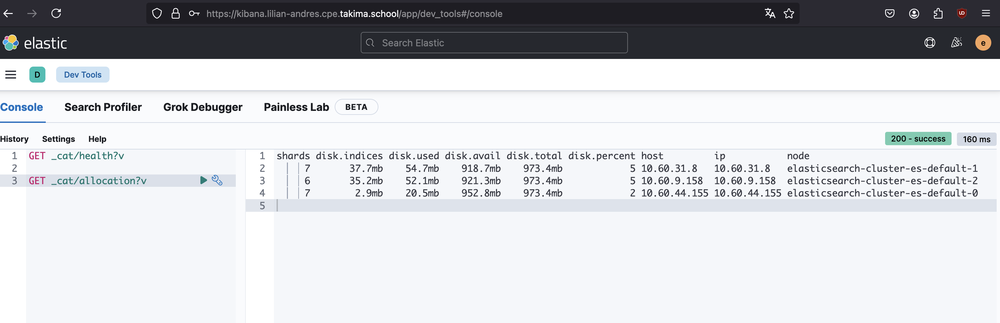
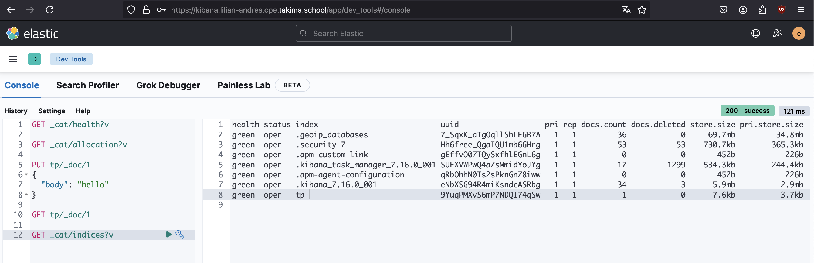
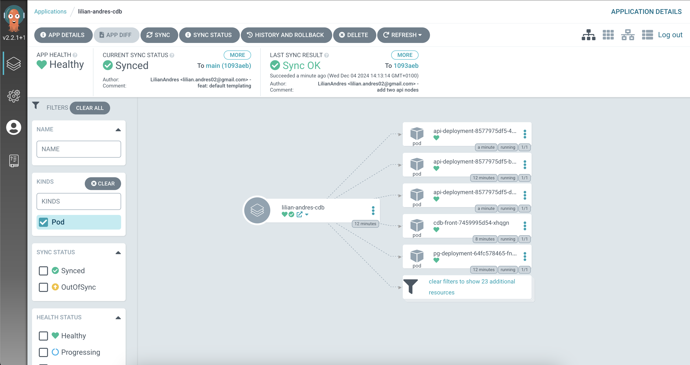
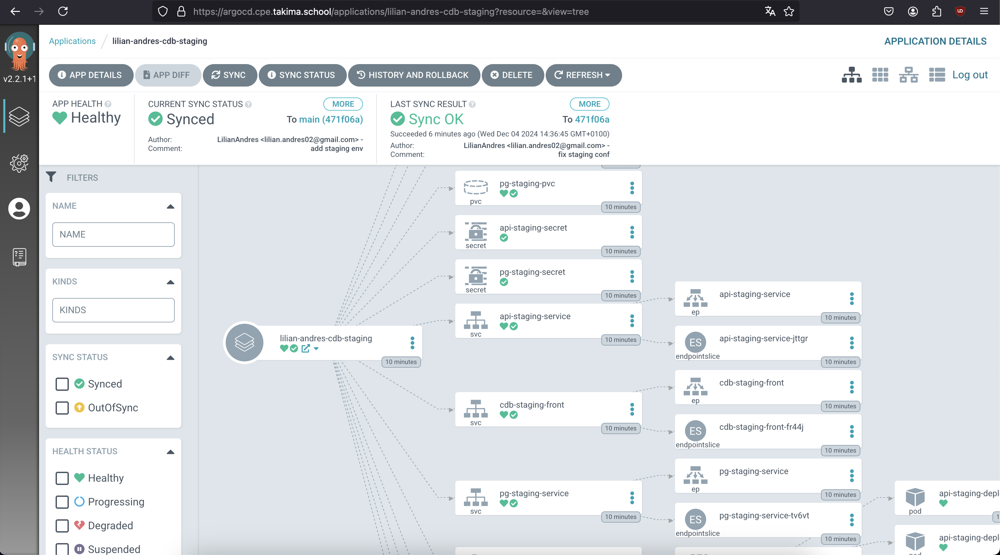
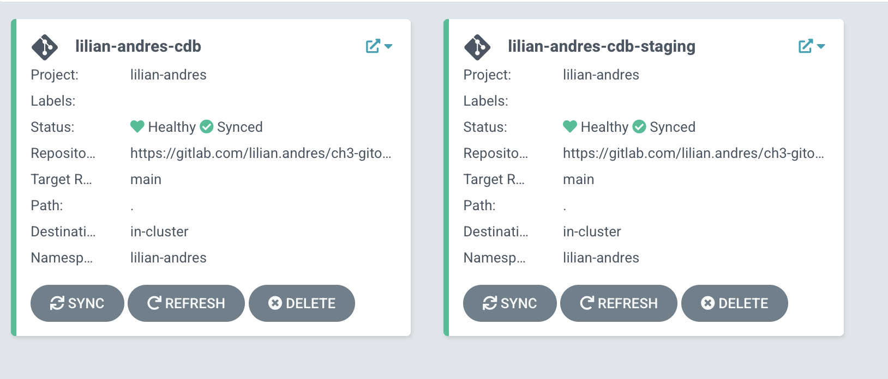

# Jour 3 - GitOps

## Elasticsearch & Kibana

Après avoir scale le cluster ELK à 3 nodes, on constate que les requêtes réalisées depuis notre interface Kibana sont désormais envoyées à chacun des trois noeuds du cluster, qui forment une réponse commune.

On obtient donc les informations liées au stockage des 3 noeuds:

Après avoir créé une ressource dans le cluster ELK, on s'assurer que l'indice `tp` existe:

Notre cluster est fonctionnel !

## Helm

Aucune question mentionnée dans le TP.

Le code de cette partie peut être consulté à l'adresse: https://gitlab.com/lilian.andres/ch3-gitops.

Bonus 1 :x:
Bonus 2 :x:
Bonus 3 :white_check_mark: (réalisé dans le bonus ArgoCD)

## ArgoCD

### Pour vérifier que tout fonctionne, essayez de détruire un deployment manuellement dans votre Cluster. Que se passe-t-il ?

Lorsqu'un déploiement est supprimé manuellement sur mon cluster, on ne remarque aucun changement.

En effet, le fait d'avoir synchroniser notre répertoire avec notre cluster a forcé la ré-création du déploiement afin d'être toujours synchroniser avec le contenu de répertoire Gitlab.

### Essayez de modifier le values.yaml en augmentant le replicaCount par exemple. Que se passe-t-il ?

Après avoir modifié le replicaCount de l'API afin d'ajouter deux Pods supplémentaires, puis poussé le code sur la branche main,
j'ai pu observer la création de ces deux nouveaux Pods automatiquement dans mon cluster (update déclenché par ArgoCD directement).

### Bonus: ajouter un environnement staging sur ArgoCD

