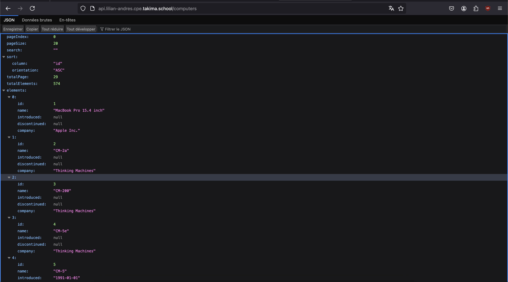
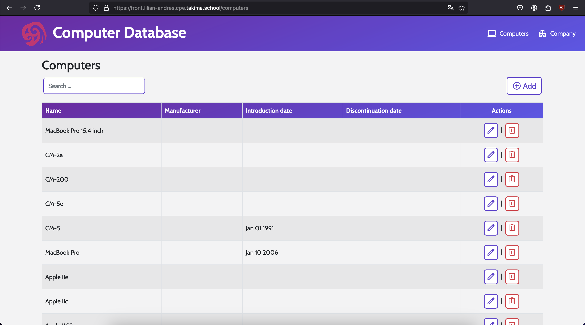

# Jour 2 - Architecture 3-tiers

## Step 1: Déployer l'API

### Que se passe-t-il au niveau des Pods de l’API ? Vous pouvez jeter un œil aux logs. (kubectl logs -f nomdupod)

Une erreur apparaît lors du déploiement de la ressource Deployment. En effet, l'API a besoin de se connecter à la base de données.
Or, cette connexion ne peut pas se faire pour le moment puisque j'ai ajouté des variables d'environnements aléatoires. De plus, le Pod de la base de données n'existe toujours pas.

## Step 2: Déployer la base de données

Check

## Step 3: Faire pointer l'API sur la base de données

### Quel est le nom du service de la base de données ?

Le nom du service de la base de données est `pg-service.lilian-andres`.



## Step 4: Rendre votre déploiement parfait

### Gestion des Probes

```yaml
readinessProbe:
  httpGet:
    path: /actuator/health/readiness
    port: 8080
  initialDelaySeconds: 5
  periodSeconds: 10
  timeoutSeconds: 5

livenessProbe:
  httpGet:
    path: /actuator/health/liveness
    port: 8080
  initialDelaySeconds: 5
  periodSeconds: 10
  timeoutSeconds: 5

startupProbe:
  httpGet:
    path: /actuator/health/liveness
    port: 8080
  initialDelaySeconds: 10
  periodSeconds: 15
  timeoutSeconds: 5
  failureThreshold: 30
```

### Gestion des flux NetworkPolicy

```yaml
apiVersion: networking.k8s.io/v1
kind: NetworkPolicy
metadata:
  name: api-network-policy
spec:
  podSelector:
    matchLabels:
      app: api
  policyTypes:
    - Egress
  egress:
    - to:
        - podSelector:
            matchLabels:
              app: pg
      ports:
        - protocol: TCP
          port: 5432
    - to:
        - namespaceSelector: {}
      ports:
        - protocol: UDP # open access to internal DNS
          port: 53
        - protocol: TCP # open access to internal DNS
          port: 53
```

```yaml
apiVersion: networking.k8s.io/v1
kind: NetworkPolicy
metadata:
  name: pg-network-policy
spec:
  podSelector:
    matchLabels:
      app: pg
  policyTypes:
    - Ingress
  ingress:
    - from:
        - podSelector:
            matchLabels:
              app: api
      ports:
        - protocol: TCP
          port: 5432
```

### SecurityContext

```yaml
spec:
  securityContext:
    runAsUser: 1001 # UID de l'API
    runAsGroup: 1001 # GID de l'API
    fsGroup: 1001
  containers:
    - name: api
      image: registry.gitlab.com/takima-school/images/cdb/api:latest
      securityContext:
      allowPrivilegeEscalation: false # Éviter les escalades de privilèges
      capabilities:
        drop:
          - ALL # Supprimer les capacités Linux inutiles
```

## Step 5: C'est au tour du front



### Pourquoi plus rien ne fonctionne ? Pourquoi faut-il kubectl rollout restart deployment MON_API ?

En l'état actuel, les données de la base de données ne sont pas persistantes, c'est-à-dire que lors de la destruction du Pod
de la base de données, les modifications apportées à la base sont perdues.

Il est nécessaire de rollout afin de forcer la re-création d'un Pod pour la base de données afin qu'il puisse s'alimenter en données.
Le redémarrage simple du Pod n'est pas utile puisque les données ne sont toujours pas sauvegardées et ne seront donc pas restaurées.
